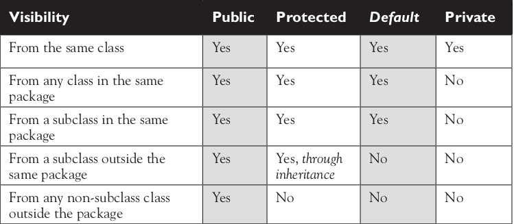
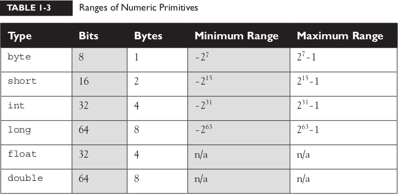
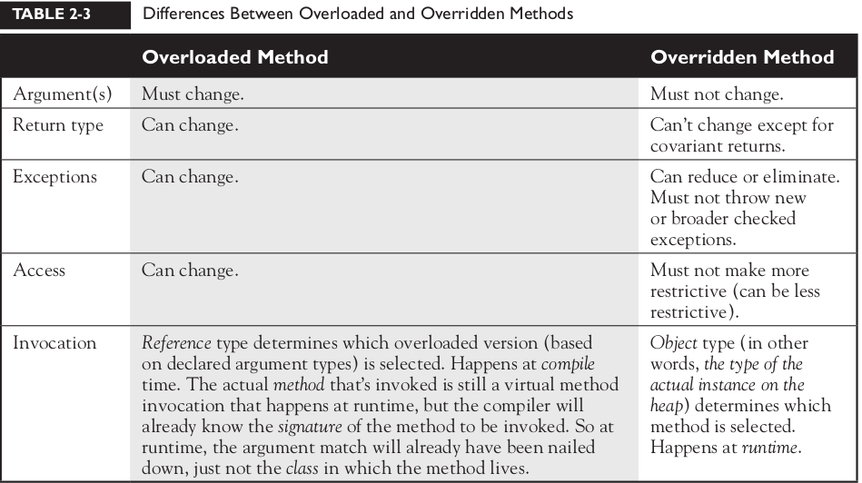

\[toc]

# Chapter 1:

standards:

*   naming: constants classes methods
*   reserved keywords
*   getter: getSize(), setter setSize()
*   clean code

There can be only one public class per source code file.

## class modifiers

two groups:

*   **Access modifiers:** public , protected , private
*   **Non-access modifiers:** including strictfp , final , and abstract

the meaning of access:
access means visibility
when we say class A has access to class B we mean

*   Create an instance of class B.
*   Extend class B (in other words, become a subclass of class B).
*   Access certain methods and variables within class B, depending on the access
    control of those methods and variables

### Default Access

Think of default access as package-level access, because a class with
default access can be seen only by classes within the same package. For example, if
class A and class B are in different packages, and class A has default access, class B
won't be able to create an instance of class A, or even declare a variable or return
type of class A.

example:

```java
package cert;
class Beverage { }
```

Now look at the second source file:

```java
package exam.stuff;
import cert.Beverage;
class Tea extends Beverage { }
```

As you can see, the superclass (Beverage) is in a different package from the
subclass (Tea). The import statement at the top of the Tea file is trying (fingers
crossed) to import the Beverage class. The Beverage file compiles fine, but when we
try to compile the Tea file we get something like:

    Can't access class cert.Beverage. Class or interface must be
    public, in same package, or an accessible member class.
    import cert.Beverage;

Tea won't compile because its superclass, Beverage, has default access and is in
a different package.

### Public Access

A class declaration with the public keyword gives all classes
from all packages access to the public class. In other words, all classes in the Java
Universe (JU) have access to a public class. Don't forget, though, that if a public
class you're trying to use is in a different package from the class you're writing, you'll
still need to import the public class.

### final modifier

When used in a class declaration, the final keyword means
the class can't be subclassed. In other words, no other class can ever extend (inherit
from) a final class, and any attempts to do so will give you a compiler error.

### abstract modifier

An abstract class can never be instantiated. Its sole
purpose, mission in life, raison d'être, is to be extended (subclassed). (Note, how-
ever, that you can compile and execute an abstract class, as long as you don't try to make an instance of it.)

## class members

you need to make a distinction between class access modifiers and member access modifiers

when class A can see class B member access modifiers act on the visibility of the member methods and variables
You need to understand two different access issues:

*   Whether method code in one class can access a member of another class
*   Whether a subclass can inherit a member of its superclass

### public members

it can always be accessed

### Private Members

Members marked private can't be accessed by code in any class other than the
class in which the private member was declared.

```java
package cert;
public class Roo {
    private String doRooThings() {
        // imagine the fun code that goes here, but only the Roo
        // class knows
        return "fun";
    }
}

package notcert;
import cert.Roo;
class UseARoo {
    public void testIt() {
        Roo r = new Roo(); //So far so good; class Roo is public
        System.out.println(r.doRooThings()); //Compiler error!
    }
}
```

**What about a subclass that tries to inherit a private member of its superclass?**

When a member is declared private, a subclass can't inherit it. You can, however, declare a matching method in the
subclass. But regardless of how it looks, it is not an overriding method! It is simply a
method that happens to have the same name as a private method (which you're not
supposed to know about) in the superclass.

### Protected and Default Members

The protected and default access control levels are almost identical, but with one
critical difference. A default member may be accessed only if the class accessing the
member belongs to the same package, whereas a protected member can be accessed
(through inheritance) by a subclass **even if the subclass is in a different package.**

Default and protected behavior differ only when we talk about subclasses. If the
protected keyword is used to define a member, any subclass of the class declaring
the member can access it through inheritance. It doesn't matter if the superclass and
subclass are in different packages, the protected superclass member is still visible to
the subclass (although visible only in a very specific way as we'll see a little later).
This is in contrast to the default behavior, which doesn't allow a subclass to access a
superclass member unless the subclass is in the same package as the superclass.
Whereas default access doesn't extend any special consideration to subclasses
(you're either in the package or you're not), the protected modifier respects the
parent-child relationship, even when the child class moves away (and joins a
new package). So, when you think of default access, think package restriction. No
exceptions. But when you think protected, think package + kids. A class with a
protected member is marking that member as having package-level access for all
classes, but with a special exception for subclasses outside the package.
But what does it mean for a subclass-outside-the-package to have access to a
superclass (parent) member? It means the subclass inherits the member. It does not,
however, mean the subclass-outside-the-package can access the member using a
reference to an instance of the superclass. In other words, protected = inheritance.
Protected does not mean that the subclass can treat the protected superclass member
as though it were public. So if the subclass-outside-the-package gets a reference to
the superclass (by, for example, creating an instance of the superclass somewhere
in the subclass' code), the subclass cannot use the dot operator on the superclass
reference to access the protected member. To a subclass-outside-the-package, a
protected member might as well be default (or even private), when the subclass is
using a reference to the superclass. The subclass can see the protected member
only through inheritance.

example

```java
package other; // Different package
import certification.Parent;
class Child extends Parent {
    public void testIt() {
        System.out.println("x is " + x); // No problem; Child
        // inherits x
    }
}

package other;
import certification.Parent;
class Child extends Parent {
    public void testIt() {
        System.out.println("x is " + x); // No problem; Child
        // inherits x
        Parent p = new Parent(); // Can we access x using the
        // p reference?
        System.out.println("X in parent is " + p.x); // Compiler
        // error!
    }
}
```

Once the subclass-outside-the-package inherits the protected member,
that member (as inherited by the subclass) becomes private to any code outside
the subclass, with the exception of subclasses of the subclass. So if class Neighbor
instantiates a Child object, then even if class Neighbor is in the same package
as class Child, class Neighbor won't have access to the Child's inherited (but
protected) variable x . The bottom line: when a subclass-outside-the-package inherits
a protected member, the member is essentially private inside the subclass, such
that only the subclass and its subclasses can access it. Figure 1-4 illustrates the effect
of protected access on classes and subclasses in the same or different packages.



### Final Methods

The final keyword prevents a method from being overridden in a subclass,

### Abstract Methods

An abstract method is a method that's been declared (as abstract ) but not
implemented. In other words, the method contains no functional code.
**It is illegal to have even a single abstract method in a class that is not explicitly
declared abstract !**

### Synchronized Methods

The synchronized keyword indicates that a method can be accessed by only one
thread at a time.

### Native Methods

The native modifier indicates that a method is implemented in platform-depen-
dent code, often in C.

### Strictfp Methods

We looked earlier at using strictfp as a class modifier, but even if you don't de-
clare a class as strictfp , you can still declare an individual method as strictfp .
Remember, strictfp forces floating points (and any floating-point operations) to
adhere to the IEEE 754 standard. With strictfp , you can predict how your floating
points will behave regardless of the underlying platform the JVM is running on.

## var args

```java
public int sumNumber(int ... args){
    System.out.println("argument length: " + args.length);
    int sum = 0;
    for(int x: args){
        sum += x;
    }
    return sum;
}
```

## constructor

Java, objects are constructed. Every time you make a new object, at least one
constructor is invoked. Every class has a constructor, although if you don't create
one explicitly, the compiler will build one for you

```java
class Foo {
    protected Foo() { }
    // this is Foo's constructor
}
```

## Variable Declarations

There are two types of variables in Java:

*   primitives: A primitive can be one of eight types: char , boolean , byte ,
    short , int , long , double , or float . Once a primitive has been declared, its
    primitive type can never change, although in most cases its value can change.
*   reference variable: A reference variable is used to refer to (or access) an
    object. A reference variable is declared to be of a specific type and that type
    can never be changed. A reference variable can be used to refer to any object
    of the declared type, or of a subtype of the declared type (a compatible type).
    We'll talk a lot more about using a reference variable to refer to a subtype in
    Chapter 2, when we discuss polymorphism.



## Local (Automatic/Stack/Method) Variables

Local variables are variables declared within a method. That means the variable is
not just initialized within the method, but also declared within the method. Just
as the local variable starts its life inside the method, it's also destroyed when the
method has completed. Local variables are always on the stack, not the heap.

## arrays

Declaring an Array of Primitives

```java
int[] key; // Square brackets before name (recommended)
int key []; // Square brackets after name (legal but less
// readable)
```

Declaring an Array of Object References

```java
Thread[] threads; // Recommended
Thread threads []; // Legal but less readable
```

We can also declare multidimensional arrays, which are in fact arrays of arrays.
This can be done in the following manner:

```java
String[][][] occupantName;
String[] ManagerName [];
```

The first example is a three-dimensional array (an array of arrays of arrays) and
the second is a two-dimensional array. Notice in the second example we have one
square bracket before the variable name and one after. This is perfectly legal to the
compiler, proving once again that just because it's legal doesn't mean it's right.

## Final Variables

Declaring a variable with the final keyword makes it impossible to reinitialize that
variable once it has been initialized with an explicit value (notice we said explicit
rather than default).

## Transient Variables

If you mark an instance variable as transient , you're telling the JVM to skip
(ignore) this variable when you attempt to serialize the object containing it.
Serialization is one of the coolest features of Java; it lets you save (sometimes called
"flatten") an object by writing its state (in other words, the value of its instance
variables) to a special type of I/O stream. With serialization you can save an object
to a file, or even ship it over a wire for reinflating (deserializing) at the other end, in
another JVM.

## Volatile Variables

The volatile modifier tells the JVM that a thread accessing the variable must
always reconcile its own private copy of the variable with the master copy in
memory.

## Static Variables and Methods

The static modifier is used to create variables and methods that will exist
independently of any instances created for the class. In other words, static
members exist before you ever make a new instance of a class, and there will be
only one copy of the static member regardless of the number of instances of that
class.
Things you can mark as static :

*   Methods
*   Variables
*   A class nested within another class, but not within a method (more on this in Chapter 8).
*   Initialization blocks

Things you can't mark as static :

*   Constructors (makes no sense; a constructor is used only to create instances)
*   Classes (unless they are nested)
*   Interfaces
*   Method local inner classes (we'll explore this in Chapter 8)
*   Inner class methods and instance variables
*   Local variables

# chapter 2:

## encapsulation:

encapsulation is when you group certain functionalities under one collection classes promote encapsulation.
one form of encapsulation is the use of getters and setters: why is using getters and setters benefecial?
imagine you build a class and it has public variables other developers change these variables directly.
now in the case that you found a bug in your code and it can be fixed only by adding some features to a setter or a getter
and making the variable private. this now is a problem because code that was built on your class will now be broken.

this problem can be avoided by using getters and setters from the start now if the class is updated (fix the bug) it won't break other developer's code.

## IS-A and HAS-A

### IS-A

IS-A is used when there's an inheritance: class Toyota IS-A Car
some as any other object IS-A Object

### HAS-A

HAS-A is used when a class reference another class inside it

```java
public class Animal { }
public class Horse extends Animal {
private Halter myHalter;
}
```

here A Horse IS-A Animal. A Horse HAS-A Halter.

## Polymorphism

the only way to access an object is through a reference variable,
and there are a few key things to remember about references:

*   A reference variable can be of only one type, and once declared, that type
    can never be changed (although the object it references can change).
*   A reference is a variable, so it can be reassigned to other objects, (unless the
    reference is declared final ).
*   **A reference variable's type determines the methods that can be invoked on    the object the variable is referencing.**
*   A reference variable can refer to any object of the same type as the declared
    reference, or—this is the big one—it can refer to any subtype of the
    declared type!
*   A reference variable can be declared as a class type or an interface type. If
    the variable is declared as an interface type, it can reference any object of any
    class that implements the interface.

A class cannot extend more than one class. That means one parent per class. A
class can have multiple ancestors, however, since class B could extend class A, and
class C could extend class B, and so on. So any given class might have multiple
classes up its inheritance tree, but that's not the same as saying a class directly
extends two classes.

```java
public interface Animatable {
public void animate();
}

class PlayerPiece extends GameShape implements Animatable {
public void movePiece() {
System.out.println("moving game piece");
}
public void animate() {
System.out.println("animating...");
}
// more code
}
```

So now we have a PlayerPiece that passes the IS-A test for both the
GameShape class and the Animatable interface. That means a PlayerPiece can be
treated polymorphically as one of four things at any given time, depending on the
declared type of the reference variable:

*   An Object (since any object inherits from Object )
*   A GameShape (since PlayerPiece extends GameShape )
*   A PlayerPiece (since that's what it really is)
*   An Animatable (since PlayerPiece implements Animatable )

The following are all legal declarations. Look closely:

```java
PlayerPiece player = new PlayerPiece();
Object o = player;
GameShape shape = player;
Animatable mover = player;
```

Polymorphic method invocations apply only to instance methods. You can
always refer to an object with a more general reference variable type (a superclass
or interface), but at runtime, the ONLY things that are dynamically selected
based on the actual object (rather than the reference type) are instance methods.
Not static methods. Not variables. Only overridden instance methods are
dynamically invoked based on the real object's type.

## overriding and overloading

### overriding

overriding is when you re-implement an inherited method without changing its signature.

The rules for overriding a method are as follows:

*   the signature(argument list types, and return type) must be the exact same as the superclass method
*   The access level can't be more restrictive than the overridden method's.
*   The access level CAN be less restrictive than that of the overridden method.
*   Instance methods can be overridden only if they are inherited by the subclass.
    A subclass within the same package as the instance's superclass can override
    any superclass method that is not marked private or final . A subclass in a
    different package can override only those non- final methods marked pub-
    lic or protected (since protected methods are inherited by the subclass).
*   The overriding method CAN throw any unchecked (runtime) exception,
    regardless of whether the overridden method declares the exception. (More
    in Chapter 5.)
*   The overriding method must NOT throw checked exceptions that are new
    or broader than those declared by the overridden method. For example, a
    method that declares a FileNotFoundException cannot be overridden by a
    method that declares a SQLException, Exception, or any other non-runtime
    exception unless it's a subclass of FileNotFoundException.
*   The overriding method can throw narrower or fewer exceptions. Just because
    an overridden method "takes risks" doesn't mean that the overriding subclass'
    exception takes the same risks. Bottom line: an overriding method doesn'tOverridden Methods (Exam Objectives 1.5 and 5.4)
    103
    have to declare any exceptions that it will never throw, regardless of what the
    overridden method declares.
*   You cannot override a method marked final .
*   You cannot override a method marked static . We'll look at an example in a
    few pages when we discuss static methods in more detail.
*   If a method can't be inherited, you cannot override it. Remember that
    overriding implies that you're reimplementing a method you inherited! For
    example, the following code is not legal, and even if you added an eat()
    method to Horse, it wouldn't be an override of Animal's eat() method.

you can invoke superclass methods with `super.method()`

### overloading

Rule:

*   Overloaded methods MUST change the argument list.
*   Overloaded methods CAN change the return type.
*   Overloaded methods CAN change the access modifier.
*   Overloaded methods CAN declare new or broader checked exceptions
*   A method can be overloaded in the same class or in a subclass. In other words,
    if class A defines a doStuff(int i) method, the subclass B could define a
    doStuff(String s) method without overriding the superclass version that
    takes an int . So two methods with the same name but in different classes
    can still be considered overloaded, if the subclass inherits one version of the
    method and then declares another overloaded version in its class definition.


