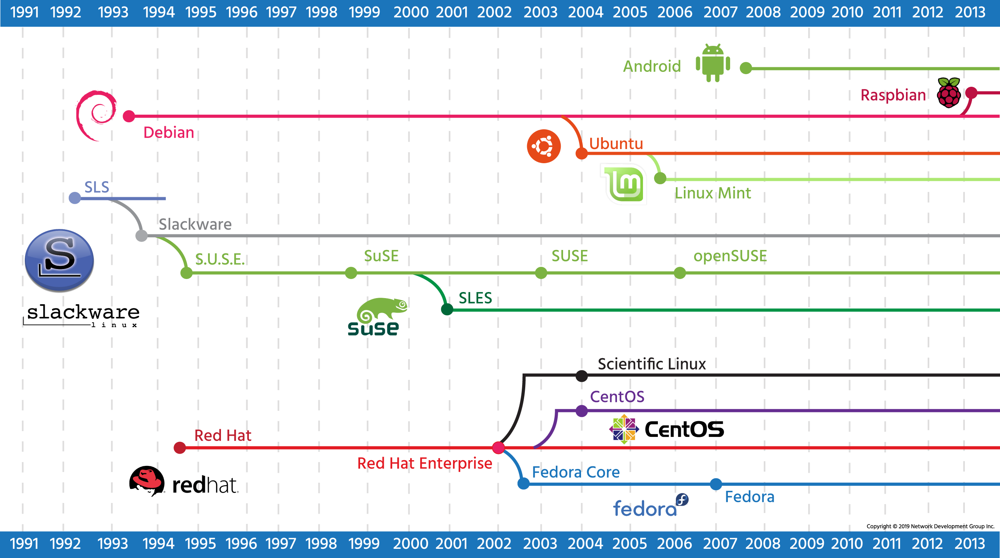

# Linux-Notes

## Introduction

When most people refer to Linux, they are really referring to a combination of software called GNU/Linux, which defines the operating
system. GNU is the free software that provides open source equivalents of many common UNIX commands. The Linux part of this combination
is the Linux kernel, which is the core of the operating system. The kernel is loaded at boot time and stays running to manage every
aspect of the functioning system.

The story of Linux begins with UNIX, an operating system developed at AT\&T Bell Labs in the 1970s. UNIX is written in the C language
making it uniquely portable amongst competing operating systems, which were typically closely tied to the hardware for which they
were written. It quickly gained popularity in research and academic settings, as well as amongst programmers who were attracted to
its modularity. Over time it was modified and forked (that is, people modified it, and those modifications served as the basis
for other systems) such that at present there are many different variants of UNIX. However, UNIX is now both a trademark and a
specification, owned by an industry consortium called the Open Group. Only software that has been certified by the Open Group may
call itself UNIX.

Linux started in 1991 as a hobby project of Linus Torvalds, a Finnish-born computer scientist studying at the University of Helsinki.
Frustrated by the licensing of MINIX, a UNIX-like operating system designed for educational use, and its creator’s desire not
to make it a full operating system, Linus decided to create his own OS kernel.

From this humble beginning, Linux has grown to be the dominant operating system on the Internet, and arguably the most important
computer program of any kind. Despite adopting all the requirements of the UNIX specification, Linux has not been certified,
so Linux really isn’t UNIX! It’s just… UNIX-like.

Prior to and alongside this development was the GNU Project, created by Richard Stallman in 1983. While GNU initially focused on
building their own operating system, they ultimately were far more effective at building tools that go along with a UNIX-like
operating system, such as the editors, compilers and user interfaces that make a kernel usable. Since the source was all freely
available, Linux programmers were able to incorporate the GNU tools to provide a complete operating system. As such, many of the
tools and utilities that are part of the Linux system evolved from these early GNU tools.

## Operating systems

### Decision Points

*   role and required functions
*   life cycle:
    *   release cycle: the period between upgrades
    *   maintenance cylce or life cycle: endors only support older versions of software for a certain period of time before not offering any updates
*   Stability
*   compatibility
*   cost
*   interface (cli / gui)

### Distributions



## Open Source Software and Licensing

In most cases, the ownership of the software remains with the person or company that created it. Users are only granted a license
to use the software; this is a matter of copyright law. The money transfer depends on the business model of the creator.
It’s the licensing that differentiates open source software from closed source software.

With Microsoft Windows, the Microsoft Corporation owns the intellectual property. The license itself, the End User License
Agreement (EULA), is a custom legal document that you must click through, indicating your acceptance, in order to install the
software. Microsoft keeps the source code and distributes only binary copies through authorized channels.

Two groups can be considered the most influential forces in the world of open source: the Free Software Foundation and the
Open Source Initiative.

FSF also advocates that software licenses should enforce the openness of modifications. It is their view that if someone modifies
free software that they should be required to share any changes they have made when they share it again. This specific philosophy
is called copyleft. According to FSF, "copyleft is a general method for making a program (or other work) free (in the sense of
freedom, not "zero price" freedom to share, study, and modify the underlying source code.), and requiring all modified and extended versions
of the program to be free as well".

### Creative Commons

Attribution (BY)	 – All CC licenses require that the creator must be given credit, without implying that the creator endorses the use.
ShareAlike (SA)		 – This allows others to copy, distribute, perform, and modify the work, provided they do so under the same terms.
NonCommercial (NC)	 – This allows others to distribute, display, perform, and modify the work for any purpose other than commercially.
NoDerivatives (ND)	 – This allows others to distribute, display, and perform only original copies of the work. They must obtain the creator’s permission to modify it.

## cli

env					:to see environment variables
export variable		:to make a local variable an environment variable
unset variable		:to remove exported variables
type <command>		:to see the command type
which <command>		:to see which path leads to that command

### quotes

**Double quotes** stop the shell from interpreting some metacharacters (special characters), including glob characters
Double quotes still allow for command substitution, variable substitution,
Glob characters, also called wild cards, are symbols that have special meaning to the shell; they are interpreted by the shell
itself before it attempts to run any command. Glob characters include the asterisk \* character, the question ? mark character,
and the brackets \[ ], among others.

**Single quotes** prevent the shell from doing any interpreting of special characters, including globs, variables, command
substitution and other metacharacters that have not been discussed yet.

**Backquotes, or backticks**, are used to specify a command within a command, a process called command substitution.
This allows for powerful and sophisticated use of commands.
\#control statements
command1; command2; command3 : executes 1 then 2 then 3
command1 && command2		 : executes 2 only if 1 didn't fail
command1 || command2		 : executes 2 only if 1 failed

## comporession and archiving

### compressing

When talking about compression, there are two types:

*   Lossless: No information is removed from the file. Compressing a file 	and decompressing it leaves something identical
    to the original.
*   Lossy: Information might be removed from the file. It is compressed in such a way that uncompressing a file will result
    in a file that is slightly different from the original. For instance, an image with two subtly different shades of green might
    be made smaller by treating those two shades as the same. Often, the eye can’t pick out the difference anyway.

<!---->

| \<!---->| \<!---->|
| - | - |
|gzip <file>		  | to compress a file and replaces the original with a compressed file.gz |
|gzip -l \<file.gz> | to see info about compression |
|gunzip \<file.gz>  | to decompress a file|

There is bzip2 and bunzip2, as well as xz and unxz.\
The gzip command uses the Lempel-Ziv data compression algorithm,\
while the bzip utilities use Burrows-Wheeler block sorting, which can compress files smaller than gzip at the expense of more CPU time.\
The xz and unxz tools use the Lempel-Ziv-Markov (LZMA) chain algorithm, which can result in lower decompression CPU times that are\
on par with gzip while providing the better compression ratios typically associated with the bzip2 tools.

zip \[OPTIONS] \[zipfile \[file…]]\
zip alpha_files.zip alpha\*\
\-r option for recursive\
zip -r School.zip School\
unzip School.zip

### archiving

it combines multiple files into one archive with .tar extension (TApe aRchive)\
The tar command has three modes that are helpful to become familiar with:

*   Create: Make a new archive out of a series of files.
*   Extract: Pull one or more files out of an archive.
*   List: Show the contents of the archive without extracting

**Create Mode**:
|tar -c| \[-f ARCHIVE] \[OPTIONS] \[FILE...]|
|-|-|
|-c			|Create an archive.|
|-f ARCHIVE	|The argument ARCHIVE will be the name of the resulting archive file.|
|-z			|Compress (or decompress) an archive using the gzip command.|
|-j			|Compress (or decompress) an archive using the bzip2 command.|

tar -cjf folders.tbz School : to create a compressed archive of the directory school\
tar -czf alpha_files.tar.gz alpha\*: to create a compressed archive of alpha\* files and dirs

**List Mode:**
Given a tar archive, compressed or not, you can see what’s in it by using the -t option. (used with f option)
tar -tf  moo.tar.gz : to view contents of the compressed archive

**Extract Mode:**
tar -x \[-f ARCHIVE] \[OPTIONS]\
\-v for verbose mode

tar -xjf folders.tbz :to extract files from the archive\
tar -xjvf folders.tbz School/Art/linux.txt : to extract a specific file

## working with text

there are 3 streams (or channels) where text is displayed:\
stdout :file descriptor 1\
stderr :file descriptor 2\
stdin  :file descriptor 0\
Use the redirection symbol > : deletes content of a file then redirects output of stdout to the file\
the  >> symbol will append\
2> to direct only stdout\
1> to direct only stderr\
2>&1 to direct both\
another form of redirection is to send the output of one command and send it to another with |\
more less: to view long text files <space> to move to the next page\
head : to view first 5 lines\
tail : to view last 5 lines\
grep : can be used with regex\
fgrep: interpret characters literally\
grep <pattern> <file>

### regex

<!-- -->

| <!-- -->| <!-- -->|
|-|-|
|.    | any single character|
|-|-|
|\[  ] |A list or range of characters to match one character|
|If the first character within the brackets is the caret ^|, it means any character not in the list|
|\* |the previous character repeated zero or more times|
|^ |if ^ is used at the begging the pattern must be at the begging of the line match|
|$ |if this one is used at the end the pattern must be at the end of the file|
|\ |to use the next character as literal|
|'' around the pattern |to prevent the shell from interpreting |

grep '^root' passwd\
grep 'sync$' passwd\
grep '.y' passwd\
grep -E or egrep is used for extended regex

## basic shell scripting

There are various shells with their own language syntax. Therefore, more complicated scripts will indicate a\
particular shell by specifying the absolute path to the interpreter as the first\
line, prefixed by #!\
like

```bash
#!/bin/bash
echo “Hello, World!”
#variables
ANIMAL="penguin"
echo "My favorite animal is a $ANIMAL"
```

it is necessary to have no spaces in the variable assignment\
capitalizing the var name is a convention

```bash
ANIMAL="penguin"
SOMETHING=$ANIMAL

CURRENT_DIRECTORY=`pwd`
echo "You are in $CURRENT_DIRECTORY"
```

$0 is the name of the script file
$1 is the first argument ...

### conditionals

```bash
if somecommand; then
  # do this if somecommand has an exit code of 0
fi
```

The test command gives you easy access to comparison and file test operators. For example:

```bash
test –f /dev/ttyS0	         0 if the file exists
test ! –f /dev/ttyS0	 	 0 if the file doesn’t exist
test –d /tmp		  	 	 0 if the directory exists
test –x `which ls`	  	 	 substitute the location of ls then test if the user can execute
test 1 –eq 1		  	 	 0 if numeric comparison succeeds
test 1 –ne 1		  	 	 test for numeric inequality
test “a” = “a”		  	 	 0 if the string comparison succeeds
test “a” != “a”		  	 	 0 if the strings are different
test 1 –eq 1 –o 2 –eq 2	 	 -o is OR: either can be the same
test 1 –eq 1 –a 2 –eq 2	 	 -a is AND: both must be the same
```

If you enclose your conditions in square brackets, it’s the same as running test. So, these statements are identical.

```bash
if test –f /tmp/foo; then
if [ -f /tmp/foo]; then

if [ "$1" = "hello" ]; then
  echo "hello yourself"
elif [ "$1" = "goodbye" ]; then
  echo "nice to have met you"
  echo "I hope to see you again"
else
  echo "I didn't understand that"
fi
```

### loops

*   for loop:

```bash
SERVERS="servera serverb serverc"
for S in $SERVERS; do
  echo "Doing something to $S"
done

for S in *; do
  echo "Doing something to $S"
done
this one operates on all the files
```

*   while loop:

```bash
i=0
while [ $i -lt 10 ]; do
  echo $i
  i=$(( $i + 1))
done

while [ condition ]; do
	#do stuff
done
i=$(( $i + 1)) this one is for incrementing
```

## hardware

arch : for computer architecture 64/32\
free -h: to see how much memory is used -h for human readable\
lscpu\
lspci \[-k to display the driver]\
lsusb\
\#hard drives\
Some hard drives make use of a partitioning technology called Master Boot Record (MBR) while others make use
of a partitioning type called GUID Partitioning Table (GPT). The MBR type of partitioning has been used since the early
days of the Personal Computer (PC), and the GPT type has been available since the year 2000.

An old term used to describe an internal hard disk is fixed disk, as the disk is fixed (not removable). This term gave rise to several command names: the fdisk, cfdisk and sfdisk commands, which are tools for working with the MBR partitioned disks.

The GPT disks use a newer type of partitioning, which allows the user to divide the disk into more partitions than what MBR supports. GPT also allows having partitions which can be larger than two terabytes (MBR does not). The tools for managing GPT disks are named similarly to their fdisk counterparts: gdisk, cgdisk, and sgdisk.\
There is also a family of tools that attempt to support both MBR and GPT type disks. This set of tools includes the parted command and the graphical gparted tool.\
Hard drives are associated with file names (called device files) that are stored in the /dev directory. Each device file name is made up of multiple parts.

*   File Type:
    The file name is prefixed based on the different types of hard drives. IDE (Intelligent Drive Electronics) hard drives begin with hd, while USB, SATA (Serial Advanced Technology Attachment) and SCSI (Small Computer System Interface) hard drives begin with sd.
*   Device Order:
    Each hard drive is then assigned a letter which follows the prefix. For example, the first IDE hard drive would be named /dev/hda and the second would be /dev/hdb, and so on.
*   Partition:
    Finally, each partition on a disk is given a unique numeric indicator. For example, if a USB hard drive has two partitions, they could be associated with the /dev/sda1 and /dev/sda2 device files.

fdisk can be used to show further information\
fdisk -l or fdisk -l /dev/sda

## where data is stored

### processes

not only contains information about running processes, as its name would suggest, but it also contains information about the system hardware and the current kernel configuration.\
ls /proc : you can see files numbered with PID numbers\
they are pseudo files because they are contained in memory (RAM)

/proc/cmdline 	Information that was passed to the kernel when it was first started, such as command line parameters and special instructions\
/proc/meminfo 	Information about the use of memory by the kernel\
/proc/modules 	A list of modules currently loaded into the kernel to add extra functionality

When the kernel finishes loading during the boot procedure, it starts the init process and assigns it a PID of 1 ( systemd )\
pstree: Processes can be “mapped” into a family tree of parent and child couplings.\
ps : shows processes running from this shell\
ps aux or -ef: to show all processes can be piped to grep\
top :\
K 	Terminate the runaway process.\
R 	Adjust the priority of the process.

### log files

Syslog is the term that is used almost generically to describe logging in Linux systems\
Some processes can log their own data to these files, other processes rely on a separate process (a daemon) to handle these log data files.\
Logging daemons differ in two main ways in recent distributions. The older method of doing system logging is two daemons (named syslogd and klogd) working together, but in more recent distributions, a single service named rsyslogd combines these two functions and more into a single daemon.\
In yet more recent distributions, those based on systemd, the logging daemon is named journald\
journalctl -r:  The standard method for viewing journald-based logs -r for reverse\
the log files themselves are almost always placed into the /var/log directory structure

| \<!----> | \<!----> |
|- |- |
| boot.log 	| Messages generated as services are started during the startup of the system. |
| cron		| Messages generated by the crond daemon for jobs to be executed on a recurring basis. |
| dmesg		| Messages generated by the kernel during system boot up. |
| maillog 	| Messages produced by the mail daemon for e-mail messages sent or received. |
| messages 	| Messages from the kernel and other processes that don't belong elsewhere. Sometimes named syslog instead of messages after the daemon that writes this file. |
| secure		| Messages from processes that required authorization or authentication (such as the login process). |
| journal 	| Messages from the default configuration of the systemd-journald.service; can be configured in the /etc/journald.conf file amongst other places. |
| Xorg.0.log 	| Messages from the X Windows (GUI) server. |

### Filesystem Hierarchy Standard

| \<!----> | \<!----> |
|- |- |
| /			| The base of the structure, or root of the filesystem, this directory unifies all directories regardless of whether they are local partitions, removable devices or network shares|
| /bin		| Essential binaries like the ls, cp, and rm commands, and be a part of the root filesystem|
| /boot	 	| Files necessary to boot the system, such as the Linux kernel and associated configuration files|
| /dev 		| Files that represent hardware devices and other special files, such as the /dev/null and /dev/zero files|
| /etc 		| Essential host configurations files such as the /etc/hosts or /etc/passwd files|
| /home	 	| User home directories|
| /lib 		| Essential libraries to support the executable files in the /bin and /sbin directories|
| /lib64	 	| Essential libraries built for a specific architecture. For example, the /lib64 directory for 64-bit AMD/Intel x86 compatible processors|
| /media		| Mount point for removable media mounted automatically|
| /mnt 		| Mount point for temporarily mounting filesystems manually|
| /opt 		| Optional third-party software installation location|
| /proc	 	| Virtual filesystem for the kernel to report process information, as well as other information|
| /root	 	| Home directory of the root user|
| /sbin	 	| Essential system binaries primarily used by the root user|
| /sys 		| Virtual filesystem for information about hardware devices connected to the system|
| /srv 		| Location where site-specific services may be hosted|
| /tmp 		| Directory where all users are allowed to create temporary files and that is supposed to be cleared at boot time (but often is not)|
| /usr 		| Second hierarchy Non-essential files for multi-user use|
| /usr/local  | Third hierarchy Files for software not originating from distribution|
| /var		| Fourth hierarchy Files that change over time|
| /var/cache 	| Files used for caching application data|
| /var/log 	| Most log files|
| /var/lock 	| Lock files for shared resources|
| /var/spool 	| Spool files for printing and mail|
| /var/tmp 	| Temporary files to be preserved between reboots|

## network

### Primary IPv4 Configuration File

/etc/NetworkManager/system-connections : contains connections info\
/etc/network/interfaces :config file

sudo service network-manager restart: to restart the whole network system and load new(if changed) config files

### DNS

/etc/hosts		 	This file contains a table of hostnames to IP addresses. It can be used to supplement a DNS server.\
/etc/resolv.conf 	This file contains the IP addresses of the name servers the system should consult in any attempt to resolve names to IP addresses. These servers are often DNS servers. It also can contain additional keywords and values that can affect the resolution process.\
/etc/nsswitch.conf 	This file can be used to modify where hostname lookups occur. It contains a particular entry that describes in what order name resolution sources are consulted.

nsswitch.conf can have this line\
hosts:files dns : this way The /etc/hosts file is searched first, the DNS server second or this line\
hosts: dns files : The DNS server would be searched first, local files second\
host example.com: returns ip of example(solve domain) or host 178.393.39.3 returns domain\
dig google.com : to see the DNS server detailed response

### network tools

ifconfig (deprecated)\
ip -c addr : -c for colors\
netstat -i   : to display statistics regarding network traffic\
netstat -tln : to view open ports -t tcp -l list -n numerical( sometimes without n is better)\
ss: netid socket type/ state active or not/ recv and sendv are queues\
ss -s :displays mostly the types of sockets statistics\
ssh: connect to another computer ssh bob@alfred(or ip) to connect to as my user to bob

## user and accounts

linux supports multiple users each user has a specific UID and also linux supports groups\
a user must have a primary group and can be part of several others\
In some Linux distributions, particularly those based upon Red Hat, when a user ID (UID) is created, a user private group (UPG) is also created with that user as its only member. In these distributions, the UID and the ID of the UPG are supposed to match

su: to change accounts(uid) (-l to login)\
id: to see the running user\
who or w:display logged in users\
last : shows the logs of logins\
/etc/passwd: has the users and their groups at the end\
/etc/shadow : has the passwords\
/etc/group: has the groups

**GIDs under 1000 for debian 500 for red hat are generally used for system groups**
groups : to see the groups the user has
groupadd : to add a a group (-g to speciy gid) (-r to add a system group GID<1000 )
groupmod : to modify a group (-n to change the name and keep gid) (-g changes gid and files owned
by this group will be unaccessible)
newgrp : to change your current primary group (just in that shell)
find / -nogroup : to find files owned by no one (called orphaned files)
groupdel : deletes a group that is no user's primary group and files will be orphaned

**useradd** : useradd will use the default config found with useradd -D
\-u : specify uid
\-g : specify a primary group
\-G : suplementary group
\-b : to specify home dir
\-m : to add a home dir (in /home/example)
usermod : to modify user
userdel : to delete user -r to remove home dir

## ownership and permissions

chgrp : change the group owner of an existing file
stat : shows more details about files ownership and permissions
chown : to change the file's user (can be used chown user:group file to change both)

when typing ll you get for example "- rw- r-- r--"
first letter is for the nature of the file d for dir - for file (can be other letters)
the next nine characters demonstrate the permissions of the file.
first three: user owner : permissions for the user that owns the file
second three: group owner : permissions for the group that owns the file
last three: others : This group includes all users who are not the file owner or a member of the file's group.

read: r      \\\
write: w      |-> these depend on the nature of the file (dir or file)\
execute:x    /\
if the privelege is attributed it gets a character other wise itis marked with -
**Read:**

*   On a file, this allows processes to read the contents of the file, meaning the contents can be viewed and copied.
*   On a directory, file names in the directory can be listed, but other details are not available.
    **Write:**
*   A file can be written to by the process, so changes to a file can be saved. Note that w permission really requires r
    permission on the file to work correctly.
*   On a directory, files can be added to or removed from the directory. Note that w permission requires x permission
    on the directory to work correctly.
    **Execute:**
*   A file can be executed or run as a process.
*   On a directory, the user can use the cd command to "get into" the directory and use
    the directory in a pathname to access files and, potentially, subdirectories under this directory.

**chmod**: to change the file permissions (only owner or root)
There's two ways first one
\~~the symbolic method
u: user, g: group, o: other, a: all
\+: add privelege, - : remove privelege, = to make it equal
examples:
chmod g+w file  :adds write privelege to the group owner
chmod ug+x,o-r file : adds x for users and group and remove r from others
chmod u=rx file : now the user permissions are r-x
\~~the numeric method:
like binary system r represents 4, w represents 2, x represents 1
rwx is 7, --- is 0, r-- is 4, -w- is 2, r-x is 5
example:
chmod 754 file : permission for file now is rwxr-xr--

## special files and dirs

**setuid**

When the setuid permission is set on an executable binary file (a program)the binary file
is run as its owner, not as the user who executed it
passwd command has this proprety because it can be run with a normal user and it can access shadow file as root
ls -l /usr/bin/passwd -> -rwsr-xr-x root root : the s is for setuid
chmod u+s file or chmod 4775 file (add 4000): to add setuid to a file
chmod u-s file or chmod 0775 file (substract 4000): to remove setuid from a file

**setgid**

The setgid permission is similar to setuid, but it makes use of the group owner permissions. There are two forms of setgid
permissions: setgid on a file and setgid on a directory.
\~~Setgid on Files:
allows a user to run an executable binary file in a manner that provides them additional group access
\~~setgid on Directories:
When set on a directory, the setgid permission causes files created in the directory to be
owned by the group that owns the directory automatically
a lowercase s meants the setgitd and groupe execute permissions are set
An uppercase S means that only setgid and not group execute permission is set

chmod g+s <file> or chmod 2775 <file> (add 2000): to add setgid to a file
chmod g-s <file> or chmod 0775 <file> (substract 2000): to rm setgid permissions

**sticky bit**
The sticky bit permission is used to prevent other users from deleting files that they do not own in a shared directory
Recall that any user with write permission on a directory can create files in that directory,
as well as delete any file in the directory, even if they do not own the file!
ls -ld /tmp -> drwxrwxrwt
A lowercase t means that both the sticky bit and execute permissions are set for others.
An uppercase T means that only the sticky bit permission is set.
chmod o+t <dir> or chmod 1775 <dir> (add 1000) : to add the sticky bit permission
chmod o-t <dir> or chmod 0775 <dir> (remove 1000): to remove sticky bit permission

**hard links**
Every file on a partition has a unique identification number called an inode number
what defines a file is not its name, but rather the number it has been assigned.
The inode table does not include the file name. For each file, there is
also an entry that is stored in a directory's data area (data block) that includes
an association between an inode number and a file name.
ls -i : shows the inode number
ln <target> <link-name>: to create a hard link

**soft links**
A symbolic link, also called a soft link, is simply a file that points to another file.
can be used to link dirs ( unlike hard links ) they are just like shortcuts in windows
ln -s <file> <link>:to create a symlink supply fullpath for the file

**Comparing Hard and Symbolic Links**
\#Hard links don’t have a single point of failure.
if you delete the source you can still access the link but with symlink if you delete source you can't access file anymore
\#Soft links can link to any file.
Since each file system (partition) has a separate set of inodes, hard links cannot be created that attempt to cross file systems
and symlinks can
\#Soft links can link to a directory.

## other

du -shc \* : returns the size of all directories (-s for not recursive -h human readable -c for a total \* for all dirs in this dir)
find :This very flexible command allows searching with a host of options such as filename, size, date, type and permission
find <dir> -name <name>
